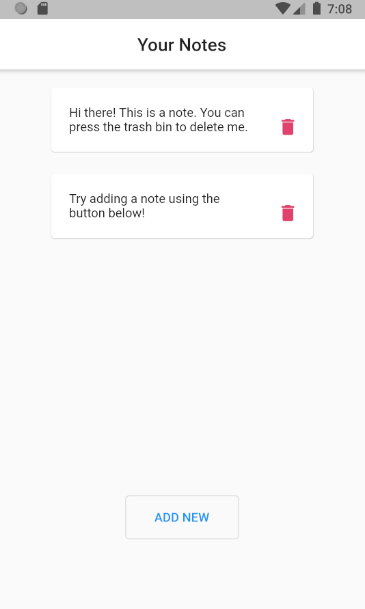
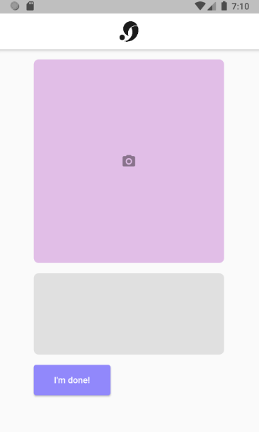

# Project Clair <!-- omit in toc -->

> A mobile app that interprets sign language (ASL Alphabet) from the user and turns it into text that can be saved as notes. 
> 
> A collaboration project between Digital Design and Programming students from VFS
> - Concept and design done by Pradhiksha Yogasaravanan 
> - Machine learning integration and training done by Itzel Salvador.
> - UI programming & App State done by Sabastian Peters.
> 
> Built using [Flutter](https://flutter.dev/) and [TensorFlowLite](https://www.tensorflow.org/lite) with samples from [Kaggle](https://www.kaggle.com/datamunge/sign-language-mnist).
>
> It has been tested to run on both emulated and real devices for Android and iOS.

### Table of Contents

- [Running the App](#running-the-app)
- [Screenshots](#screenshots)

## Running the App

- download / clone project from git
- open up the project folder called `project_clair` in prefered editor
  - [here's google's documentation on setting up your choice of editor](https://flutter.dev/docs/get-started/editor)
- the guide should also have instructions for running the app
  - in VSCode, press F5 to run the app
  - `flutter run` from the command line inside the `project_clair` folder should also work

## Screenshots

